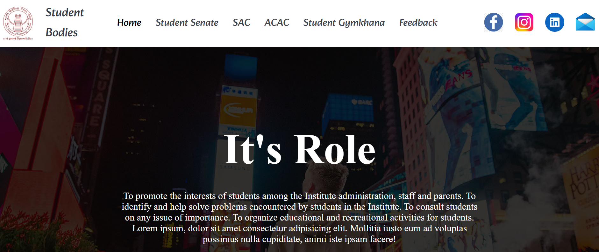
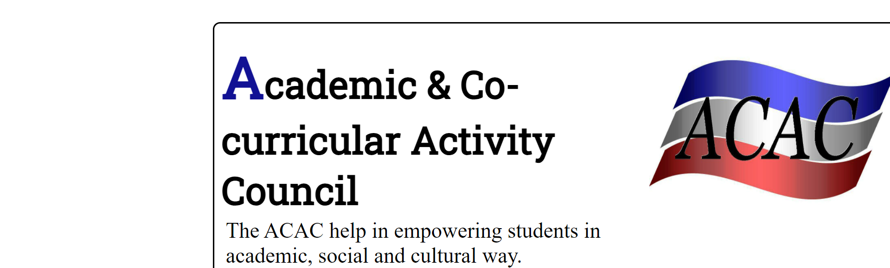
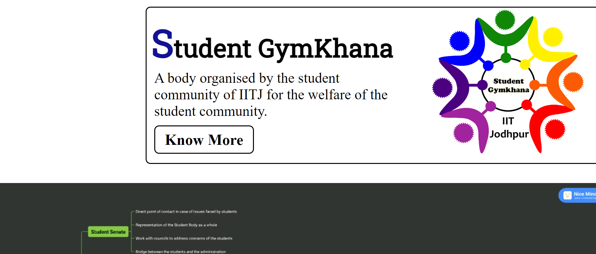

# Student-Bodies

Here is a website demonstrating its appearance:

This website serves as an essential resource for college newcomers, providing crucial information about campus life and residency. It is designed to empower students with the knowledge they need to thrive, enhancing the overall college experience. By engaging students in continuous improvement, we strive to make our college community stronger and more dynamic.

# Features
- Well established UI/UX.
- A comprehensive chart illustrating the interconnected branches for a clear overview of the college's structure

# Way to use
1. Begin by cloning the repository.
2. Navigate to the project directory with `cd student-bodies`.
3. Ignite the application with `node index.js`.

# Contributions
I warmly welcome your contributions! Feel free to fork this repository, implement your amazing ideas, and submit a pull request. Join us in enhancing this project together!
